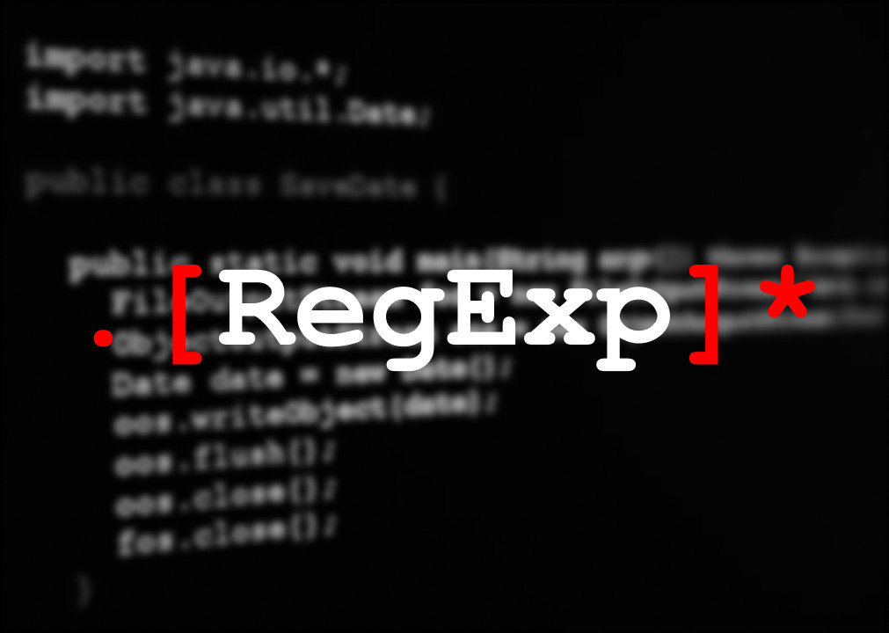
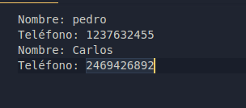

Las expresiones regulares nos sirven para representar modelos de patrones que coincidan con textos que sean de nuestro interés.

Con estos patrones podemos realizar búsquedas o filtrar información para solo recibir los datos que nos interesan o solo aceptar un formato válido en la presentación de dicha información.

## Clases (modelos)

Se pueden representar caracteres o conjuntos de caracteres por medio de expresiones envueltas en corchetes "[ ]". Estas expresiones pueden contener literalmente los caracteres con los que hará coincidencia la clase, por ejemplo:

`[aym]` coincide con las letras **_a_**, **_y_** y **_m_**.

También pueden contener rangos de caracteres como por ejemplo:

- `[0-6]` Coincide con los dígitos del 0 al 6.
- `[a-d]` Coincide con las letras minúsculas desde la **_a_** hasta la **_d_** sin acentos.

### Negación

Cuando lo que deseamos especificar no es el carácter o conjunto de caracteres a representar sino todo lo contrario (los caracteres que no deseamos aceptar), entonces usamos el carácter `^` al comienzo de la clase así:

- `[^dgy]` Coincide con cualquier carácter que no sea **_d_**, **_g_** o **_y_**.
- `[^0-9]` Coincide con cualquier carácter que no sea un dígito.

### Clases predefinidas

Existen algunas expresiones ya definidas que coinciden con un carácter o un grupo de ellos, algunas de estas son:

- `.` = `[^n]` Cualquier carácter (no incluye el salto de línea).
- `\w` = `[a-zA-Z0-9_]` Números, letras y guión bajo (no incluye acentos ni la ñ).
- `\d` = `[0-9]` Dígitos.
- `\s` Espacios, tabulaciones y saltos de línea.
- `\t` Tabulaciones.
- `\n` Saltos de línea.
- `\W` = `[^a-zA-Z0-9_]` Cualquier carácter que no sea alfanumérico.
- `\D` = `[^0-9]` Cualquier carácter que no sea un dígito.
- `\S` Cualquier carácter que no sea un espacio, una tabulación o un salto de línea.

## Caracteres especiales

Algunos caracteres como los corchetes que se usan para envolver los modelos son caracteres con significados especiales que si se quisieran representar en un modelo podrían ocasionar errores, por lo que para su uso como carácter debe anteponerse el símbolo `\` que en sí mismo también es un carácter especial con la función de escapar los caracteres que poseen significados especiales o darle significado a otros que no lo poseen.

Los carácteres especiales son: `.`, `\`, `/`, `^`, `[`, `]`, `(`, `)`, `-`, `+`, `*`, `?`, `{`, `}`, `$`, `|`, `<`, `>`.

Por ejemplo, si queremos incluir el carácter `\` y los dígitos en una clase lo usaríamos así `[0-9\\]`. Y si quisieramos incluir las letras mayúsculas y minúsculas sin acentos y los paréntesis usaríamos `[a-zA-Z\(\)]`.

## Agrupación

Los paréntesis "( )" sirven para agrupar secciones de nuestras expresiones regulares con el fin de definir ámbitos o precedencia de operadores y así evitar errores en la interpretación de la expresión y proporcionar información adicional a los lenguajes de programación en los que se utilizan.

Por ejemplo, si defino una expresión regular que consta de dos partes, una son letras y otra son números para que coincida con un texto que tiene nombres y números de teléfonos separados por un espacio. Podría verse así la expresión

`([a-zA-Z]+) ([0-9]{10,10})`

Como se puede ver se agrupó la sección del nombre y la sección del número, lo que permitiría identificar las secciones cuando estamos realizando una búsqueda en un editor de texto que soporte la búsqueda por medio de expresiones regulares o en un lenguaje de programación.

Si deseamos obtener el campo del número de teléfono por medio de un editor de texto que soporte la búsqueda por medio de expresiones regulares o un lenguaje de programación podremos usar el término `$2` que se refiere al segundo grupo.

Si en cambio quisieramos obtener el nombre lo haríamos usando el término `$1` que se refiere al primer grupo.

En algunos lenguajes de programación o editores de texto pueden haber algunas variaciones.

## Cuantificación

Cuando expresamos una clase o indicamos una expresión regular sin ningún elemento adicional estamos indicando que por cada carácter que se ajuste a nuestra expresión regular o clase habrá una coincidencia.

Entonces si por ejemplo tenemos la expresión `[a]` y tenemos el texto **_aaaa_** tendremos 4 coinciencias.

Pero si lo que deseo es que el texto **_aaaa_** coincida completo con mi expresión podemos usar cuantificadores.

- `*` Indica cero o muchas repeticiones.
- `+` Indica una o muchas repeticiones.
- `?` Indica que puede o no puede incluirse esta parte en el texto.
- `+?` Indica una o muchas repeticiones pero escoge la unidad más pequeña que encuentre.

Ejemplos:

- Si quiero indicar que pueden haber muchos o ningún carácter lo expreso como `.*`
- Si quiero indicar que pueden haber una o muchas letras lo expreso como `[a-zA-Z]+`
- Si quiero indicar que puede o no incluir el símbolo **_@_** lo expreso como `@?`

También tenemos la opción de indicar por medio de intervalos la cantidad de veces que puede aparecer un carácter o un conjunto de caracteres indicando el valor mínimo de repeticiones y el valor máximo de repeticiones entre llaves separados por una coma así:

Si quiero indicar que pueden haber de 3 a 12 dígitos lo expreso como `\d{3,12}`

## Inicio y fin de una línea

Hasta el momento si escribimos una expresión regular hará coincidencia inlcuso con textos que poseen carácteres adicionales a los que se han indicado en la expresión, realizando búsquedas poco estrictas o un filtrado ineficiente.

Para indicarle el comienzo y final de una línea y que la expresión regular se evalue exactamente como está escrita en cada línea, se debe agregar el símbolo `^` al comienzo de la expresión y el símbolo `$` al final.

Así si queremos por ejemplo en un documento buscar una línea que posea un nombre y un teléfono de 10 dígitos separados de un guión tendremos la expresión.

`^[a-zA-Z]+[\-][\d]{10,10}$`

## Alternación

Cuando queremos indicar que se realice una coincidencia con una u otra expresión pero no con ambas usamos el símbolo `|`.

Por ejemplo, si queremos aceptar dígitos o letras en una línea pero no ambos usaríamos la expresión `^([0-9]|[a-zA-Z])$`

## Herramientas y usos

Una herramienta muy útil para visualizar la estructura de las expresiones regulares que estamos creando y para probarlas es [Debuggex](https://www.debuggex.com/#cheatsheet).

### Ejemplos usando Debuggex

Ejemplo de agrupación en el que una línea debe coincidir con un nombre y un teléfono separados por un espacio usando la expresión `^([a-zA-Z]+) ([0-9]{10,10})$`

Ejemplo de alternación cuando queremos aceptar dígitos o letras en una línea pero no ambos usando la expresión `^([0-9]+|[a-zA-Z]+)$`

### Usando Visual Studio Code

En este y otros editores de texto además de la opción de búsqueda por texto también nos permite usar una opción de búsqueda por medio de expresiones regulares que nos da mucha potencia en la edición y filtro de la búsqueda.

Podríamos probar haciendo un listado de nombres y números de 10 dígitos separados por espacios y a algunas de estas líneas podríamos aumentarle, disminuirle o agregarle carácteres de modo que no coincidan algunas.

Y realizamos la búsqueda con la expresión regular `^([a-zA-Z]+) ([0-9]{10,10})$`

Como vemos nos marca en coincidencias con la búsqueda las líneas que se ajustan a nuestra expresión regular.

Para eliminar las líneas que no coinciden con el parámetro de búsqueda damos click derecho en el documento y seleccionamos la opción **Cambiar todas las ocurrencias** que ubicará varios selectores en el final de cada línea que tenga una coincidencia.

Para seleccionarlas podemos usar la combinación de teclas **`Shift`** + **`Inicio`** y luego cortamos la selección usando la combinación de teclas **`Ctrl`** + **`x`**.

Esto nos deja solo las líneas que no coinciden con nuestro parámetro de búsqueda, lo borramos todo y pegamos el texto que habíamos cortado previamente así obteniendo solo los resultados con el formato correcto.

Ahora queremos cambiar ese formato por uno en el que se indique la palabra **Nombre** seguida de dos puntos, un espacio y en seguida el nombre y en una segunda línea la palabra **Teléfono** seguida de dos puntos, un espacio y el número de teléfono. Es decir, vamos a dividir cada línea en dos líneas.

Entonces en el campo de reemplazar vamos a usar la expresión `Nombre: $1\nTeléfono: $2`, donde `$1` se refiere al primer grupo en nuestra expresión regular, `$2` al segundo grupo y `\n` indica un salto de línea. Con esto le indicamos que reemplace todas las coincidencias.

Con eso obtenemos solamente la información que es útil y en el formato deseado.

